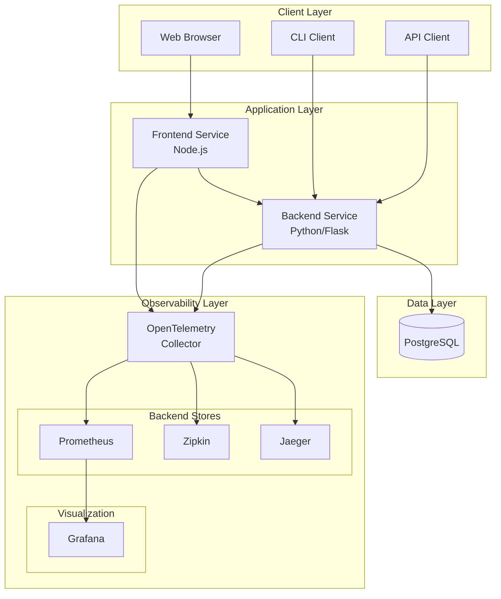

# OpenTelemetry Demo - Architecture

## Overview

This document describes the architecture of the OpenTelemetry Demo application, a distributed system designed to demonstrate comprehensive observability using OpenTelemetry.

## System Architecture

## Component Details
### 1. Frontend Service (Node.js/Express)

Purpose: Web interface and API gateway

Responsibilities:

* Serve web interface to users
* Proxy requests to backend services
* Instrument HTTP requests with OpenTelemetry
* Generate trace context for distributed tracing

Key Technologies:

* Node.js + Express.js
* OpenTelemetry JavaScript SDK
* Axios for HTTP requests

### 2. Backend Service (Python/Flask)

Purpose: Business logic and data processing

Responsibilities:

* Handle business logic
* Database operations
* External API calls (simulated)
* Generate spans for internal operations

Key Technologies:

* Python + Flask
* PostgreSQL with psycopg2
* OpenTelemetry Python SDK
* Various instrumentations

### 3. Database (PostgreSQL)

Purpose: Persistent data storage

Schema:

* users table: User information
* products table: Product catalog
* orders table: Order records (optional)

### 4. OpenTelemetry Collector

Purpose: Collect, process, and export telemetry data

Configuration:

* OTLP receivers (gRPC and HTTP)
* Batch processing
* Multiple exporters (Jaeger, Zipkin, Prometheus, logging)

### 5. Observability Backends

Jaeger

* Purpose: Distributed tracing backend
* Features: Trace visualization, dependency analysis
* Port: 16686 (UI)

Zipkin

* Purpose: Alternative tracing backend
* Features: Trace visualization, compatibility
* Port: 9411 (UI)

Prometheus

* Purpose: Metrics collection and storage
* Features: Time-series metrics, alerting
* Port: 9090 (UI)

Grafana

* Purpose: Metrics visualization
* Features: Dashboards, analytics
* Port: 3000 (UI)

## Data Flow

### Trace Propagation

1. Request Initiation:

- Client makes request to Frontend
- Frontend creates root span and propagates context

2. Service-to-Service Communication:

- Frontend includes trace context in headers to Backend
- Backend continues trace with child spans

3. Database Operations:

- Backend creates spans for database queries
- PostgreSQL instrumentation adds query details

4. Trace Export:

- Both services export spans to Collector
- Collector processes and forwards to Jaeger/Zipkin

### Metrics Collection

1. Application Metrics:

- Services expose Prometheus metrics
- Collector scrapes and forwards metrics

2. Infrastructure Metrics:

- Docker container metrics
- System resource usage

## Deployment Architecture

### Development Environment

* Single-node Docker Compose
* All services running locally
* Sample data pre-loaded

### Production Considerations

* Container orchestration (Kubernetes)
* High availability configurations
* Secure communication (TLS)
* Scalable storage backends

## Configuration Management

### Environment Variables

* Service configuration
* Feature flags
* External service endpoints

### Docker Compose

* Service definitions
* Network configuration
* Volume mappings

### Security Considerations

* Network segmentation between services
* Secure credential management
* API authentication/authorization
* TLS for external communications

## Monitoring and Alerting

### Health Checks

* HTTP health endpoints
* Docker health checks
* Service dependency monitoring

### Performance Metrics

* Request latency
* Error rates
* Resource utilization
* Database performance

## Scaling Considerations

### Horizontal Scaling

* Stateless service replication
* Database connection pooling
* Load balancer configuration

### Vertical Scaling

* Resource allocation optimization
* Database performance tuning
* Caching strategies